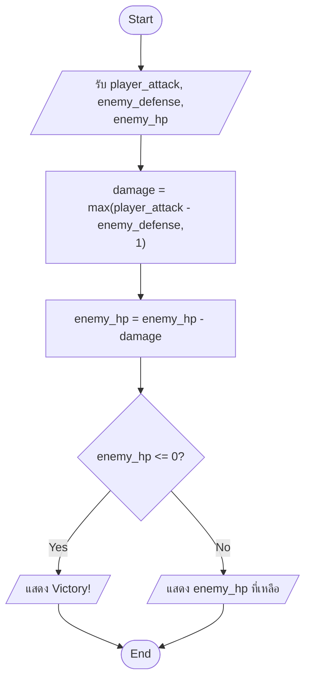
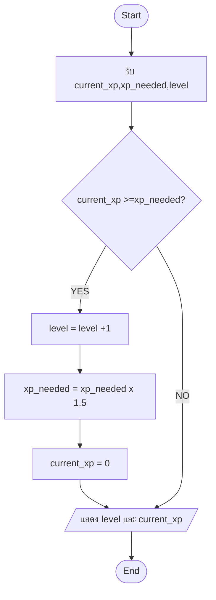
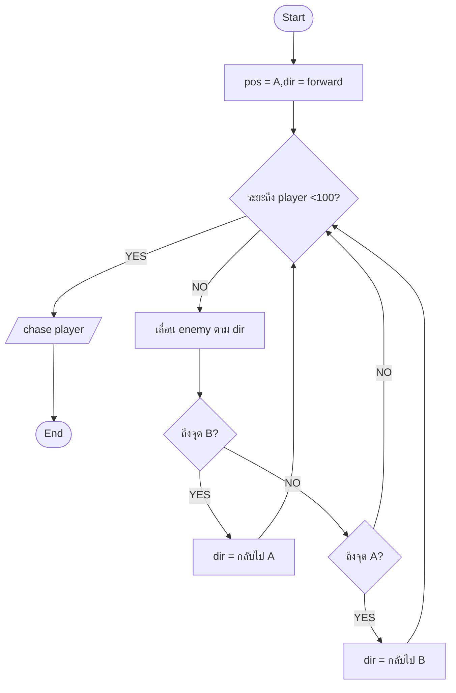

1.ระบบ combat

```mermaid
flowchart TD
Start([Start]) --> Input[/รับ player_attack, enemy_defense,
enemy_hp/]
Input --> Calc["damage = max(player_attack - enemy_defense,
1)"]
Calc --> Reduce["enemy_hp = enemy_hp - damage"]
Reduce --> D1{enemy_hp <= 0?}
D1 -->|Yes| Win[/แสดง Victory!/]
D1 -->|No| Show[/แสดง enemy_hp ที่เหลือ/]
Win & Show --> End([End])
```

2.ระบบ Level Up

```mermaid
flowchart TD
Start([Start]) --> Process[รับ current_xp,xp_needed,level]
Process --> If{current_xp >=xp_needed?}
If -- YES --> lv[level = level +1]
lv --> Xp[xp_needed = xp_needed x 1.5]
Xp --> Current[current_xp = 0]
Current --> Input
If -- NO --> Input[/แสดง level และ current_xp/]
Input --> End([End])

```

3.Simple AI Patrol

```mermaid
flowchart TD
Start([Start]) --> Process[pos = A,dir = forward]
Process --> Range{ระยะถึง player <100?}
Range -- YES -->Chase[/chase player/]
Chase --> End([End])
Range -- NO -->MoveEnemy[เลื่อน enemy ตาม dir]
MoveEnemy --> Bspot{ถึงจุด B?}
Bspot -- YES --> DirA[dir = กลับไป A]
DirA --> Range
Bspot -- NO --> Aspot{ถึงจุด A?}
Aspot -- YES --> DirB[dir = กลับไป B]
DirB --> Range
Aspot -- NO --> Range
```
